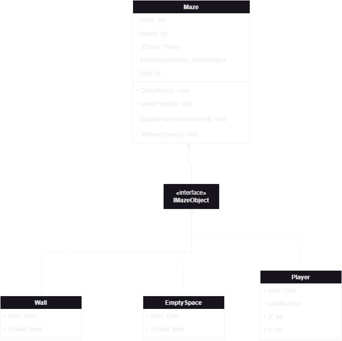
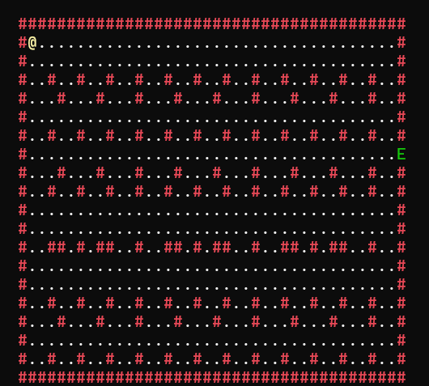

# Maze Game




## Project Description

Maze Game is a console-based game where the player navigates through a randomly generated maze to reach the exit. The player can move up, down, left, or right to find their way to the exit marked in green. The maze is generated with boundaries and inner walls to create a challenging path.

## Features

- Randomly generated maze with boundaries and inner walls.
- Player movement with keyboard arrows.
- Colored representation of the player, walls, and exit.
- Winner screen when the player reaches the exit.

## Installation

1. Clone the repository:
   ```sh
   git clone https://github.com/fares7elsadek/Maze-Game-C-.git
   ```
2. Open the solution in your preferred C# IDE (e.g., Visual Studio).
3. Build the solution to restore the necessary dependencies.

# Maze Game

## Usage
Run the project to start the game. The objective is to move the player (`@`) through the maze and reach the exit (`E`) to win the game.

## Controls
Use the arrow keys to move the player:
- **Up Arrow:** Move up
- **Down Arrow:** Move down
- **Left Arrow:** Move left
- **Right Arrow:** Move right

Enjoy navigating the maze and finding your way to the exit!
